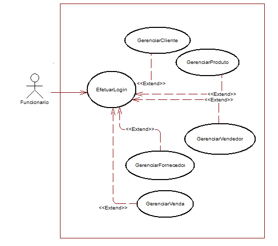
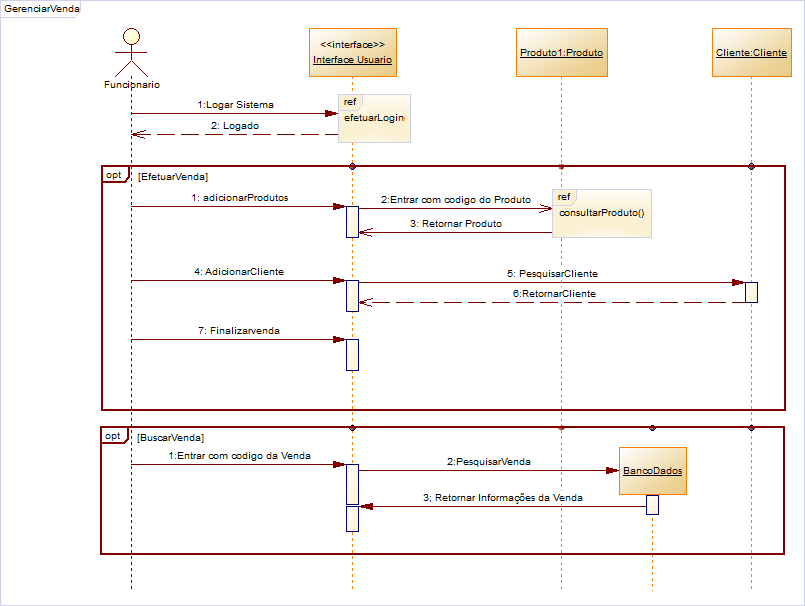
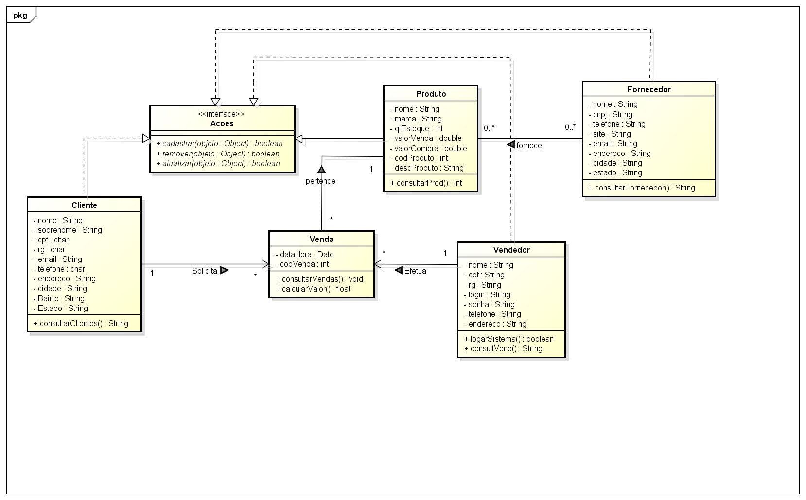

#SisWtec
##System for management to one physical market.

## [Acess Complete project in Github](https://github.com/pablomelo-inf/Wtec)
 

## About the SisWtec
SisWtec is a solution for managment sales and costumer in a Physical Stores.
## Customer challenges:
1 - The Salles aren't automatized. All are anoted in notepad manually.
2 - The products are in a catalogue noted.
3 - The customer speend lot time for manage stock manually.

## The Wtec propose solve this these challenges with functions:
* Managment costumer.
* Staff Controll (i.e Salesmans).
* Sales Monitoring.
* Managment Provider.
* historic for get insights and make new strategies grown.

## Sequence for do Sales

## The main building block (Class Diagram)

## Entity Relations Model 

## Source Code Structure (in Java)
- Main Packages
- 1 - *(DAO)* Data Access Object 
       provides an abstract interface for Database Management.
       - src/mercado/DAO
       
- 2 -  *Modelo* - Model:
       responsible for managing the data the application.
       - src/mercado/Modelo
       
- 3 -  *UI* - Graphical User Interface
       responsible interact with user through visual resources, also get input for processing and return results.
       - src/UI

